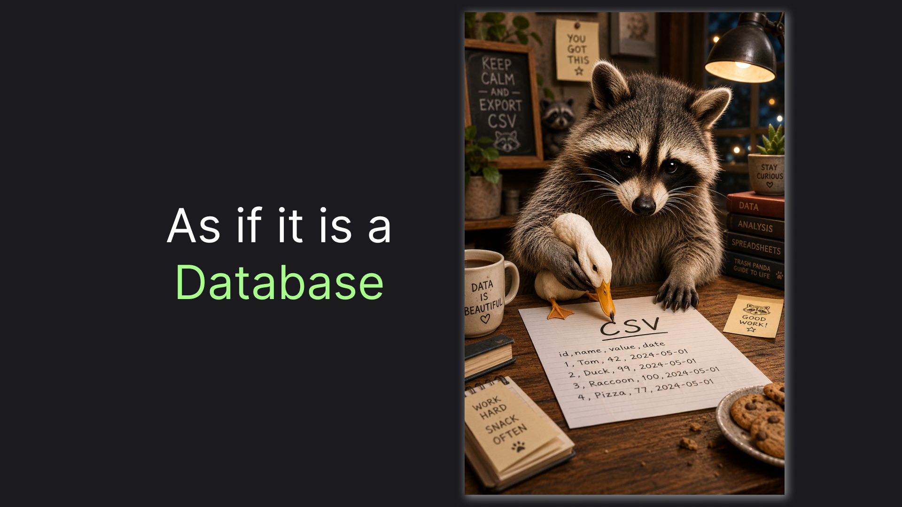

# SQL for Files - DuckDb

> How to query CSVs and JSONs using SQL with DuckDB



CSVs and JSONs are perhaps the most common formats of an export nowadays. Still, to run even a simple query on them, we typically import them to some other format first, such as a model in code, a database, or simply a spreadsheet. However, we don't really need to. DuckDb already lets us query them as if they were a database.

> DuckDb is much more than the SQL for files engine. This article, however, focuses specifically on this part of the tool, and I believe it's actually a good place to start familiarizing yourself with the technology.

## Getting Started: Simple CSV Query

At first, we, of course, have to install the tool. On mac, with brew installed, you can simply do this:

> For Windows installation please consult the DuckDb download page

```sh
brew install duckdb
```

After that, we need a data to query. We'll name our first database `orders-2025.csv` and have the following content in it:

> How cool is the fact that I can "embed" our "database" in the article, huh?

To get started let's imagine we have the followingfile:

```csv
category,amount,customer
electronics,200,1
clothing,50,2
home,90,3
electronics,300,4
clothing,20,3
```

Now, let's make the magic happen. There's an interactive and non-interactive modes in duckdb. For the reproducibility of the first step we'll go with the non-interactive one. For it we'll need to create a file with our query, let's call it `2025-category-amount.sql`. And here's the query itself:

> For the next scripts I will just show you the SQL itself without naming it or providing a command to run it
> You can use CLI in an interactive mode this way:
> 1. Type duckdb, hitting enter - welcome into interactive mode
> 2. Type your query
> 3. Type semicolon (;) in the end - I always forgot to do that
> 4. Hit Enter
> Ctrl + D when you are finished

```sql
SELECT SUM(amount), category
FROM 'orders-2025.csv'
GROUP BY category;
```

As you might see, it looks exactly like a normal sql, except that instead of table names we have a file name. Let's run it:

```sh
duckdb < 2025-category-amount.sql
```

Here's the output we should get:

```markdown
┌─────────────┬─────────────┐
│ sum(amount) │  category   │
│   int128    │   varchar   │
├─────────────┼─────────────┤
│          90 │ home        │
│         500 │ electronics │
│          70 │ clothing    │
└─────────────┴─────────────┘
```

Cool, right? The fact that I can query SQL alone already impressed me, when I found out about the technology. But let me blow your mind a little more!

## Getting Cooler: File Patterns and JSON

DuckDb is actively used in data science. Perhaps, next feature of the tool is the main reason why. Let's imagine that after file with orders for the previous year (`orders-2025.csv`)  we got orders for this year (`orders-2026.csv`):

```csv
category,amount,customer
clothing,900,3
clothing,50,3
clothing,300,3
```

How hard would it be to query, you might ask? Of course we can manually compose those documents into `orders-all.csv` and query it. The great news is that we don't have to if we use file patterns. Here's the query:

```sql
SELECT SUM(amount), category
FROM 'orders-*.csv'
GROUP BY category
```

And again it "just works" and produces us the following results:

```text
┌─────────────┬─────────────┐
│ sum(amount) │  category   │
│   int128    │   varchar   │
├─────────────┼─────────────┤
│        1320 │ clothing    │
│         500 │ electronics │
│          90 │ home        │
└─────────────┴─────────────┘
```

Let's say now we also get a next export and now instead of csv all we got is a JSON file, called `customers.json`: 

```json
[
    {
        "id" : 1,
        "country" : "Germany"
    },
    {
        "id" : 2,
        "country" : "Austria"
    },
    {
        "id" : 3,
        "country" : "Netherlands"
    },
    {
        "id" : 4,
        "country" : "Austria"
    }
]
```

Do we need to install a converter first to feed DuckDB the CSV? Not really, we can pretend that nothing happened and do the following:

```sql
SELECT COUNT(*), country
FROM 'customers.json'
GROUP BY country
ORDER BY COUNT(*) DESC
```

And again DuckDB will do the magic:

```text
┌──────────────┬─────────────┐
│ count_star() │   country   │
│    int64     │   varchar   │
├──────────────┼─────────────┤
│            2 │ Austria     │
│            1 │ Germany     │
│            1 │ Netherlands │
└──────────────┴─────────────┘
```

You might notice that, DuckDB normally "just works". We pass it whatever we expect in a SQL and it just says "Got ya". Certainly, there's a limit to that, right? Let's test it further!

## Mind Blown Away: Cross-Format JOINs and Remote Files

We got our CSVs and JSON queried. But wouldn't that be a problem to have different formats when we go to something more serious. How about we try JOINing them:

```sql
SELECT SUM(o.amount) AS total_amount, c.country
FROM 'orders-*.csv' o
JOIN 'customers.json' c ON c.id = o.customer 
GROUP BY c.country
ORDER BY SUM(o.amount) DESC
```

In a normal article, I would expect, that I will have to show you some trick or some technique to make it work. But today it "just works" again:

```text
┌──────────────┬─────────────┐
│ total_amount │   country   │
│    int128    │   varchar   │
├──────────────┼─────────────┤
│         1360 │ Netherlands │
│          350 │ Austria     │
│          200 │ Germany     │
└──────────────┴─────────────┘
```

But what if you don't even want to store a file on your local drive?
For this scenario I put `taxes.csv` on github so that it is publicly available via the link: [https://raw.githubusercontent.com/astorDev/persic/refs/heads/main/duckdb/play/taxes.csv](https://raw.githubusercontent.com/astorDev/persic/refs/heads/main/duckdb/play/taxes.csv). Here's the file content:

```csv
country,rate
Austria,0.20
Germany,0.19
Netherlands,0.21
```

Let's simply join it in our final query, as if it is normal:

```sql
SELECT SUM(o.amount * (1 - t.rate)) AS total_amount_post, c.country
FROM 'orders-*.csv' o
JOIN 'customers.json' c ON c.id = o.customer
JOIN 'https://raw.githubusercontent.com/astorDev/persic/refs/heads/main/duckdb/play/taxes.csv' t ON t.country = c.country
GROUP BY c.country
ORDER BY SUM(o.amount * (1 - t.rate)) DESC
```

It's hard to believe, but it "just works" again:

```text
┌───────────────────┬─────────────┐
│ total_amount_post │   country   │
│      double       │   varchar   │
├───────────────────┼─────────────┤
│            1074.4 │ Netherlands │
│             280.0 │ Austria     │
│             162.0 │ Germany     │
└───────────────────┴─────────────┘
```

Most importantly, it is not limited to public HTTP endpoints. It's totally possible to connect to files in private accounts on file storages like S3 or Azure services! But I think the article is big enough and show impressive enough capabilities to leave demoing such things out of scope.

So, enough magic for now, let's wrap it up!

## TLDR;

The last query in this article demonstrates the impressive capabilities of DuckDb for querying files. In this one query, we were able to:

- Query multiple CSVs as a single file using a file pattern.
- JOIN files across formats
- Use a remote file in the same query.

You can file all the scripts along with the example files in the [persic](https://github.com/astorDev/persic/duckdb/files/src) repository. The project is all persistence technologies and provides various DB-related tools. Check it out on [GitHub](https://github.com/astorDev/persic) and don't hesitate to give it a star! ⭐

Claps for this article are also highly appreciated! 😉
