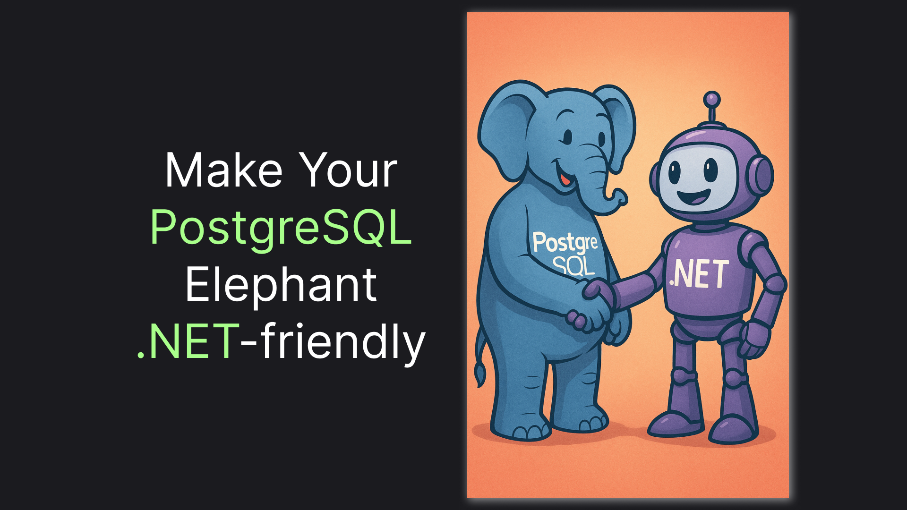

# Integrating PostgreSQL with .NET 9 Using EF Core: A Step-by-Step Guide

> A Practical Example of Connecting an ASP .NET Core App to PostgreSQL using Entity Framework



PostgreSQL is the most popular database out there, according to the [latest StackOverflow survey](https://survey.stackoverflow.co/2024/technology#1-databases). And, of course, EF Core, as a versatile ORM, plays nicely with it. Still to integrate those two, one will need to make a few steps with a few caveats along the way. In this article, we will go through those steps together, implementing a couple of helper methods to make the integration even simpler in the future.

> If you just want to use the simplified PostgreSQL connection, jump straight to the end of this article to the [TLDR;](#tldr) section.

## Setting Up the Project: Postgres Deployment with Docker Compose & Initial Raw Connection

To start, let's set up a local instance of PostgreSQL. Here's a simple `compose.yml` that does just that:

```yaml
services:
  postgres:
    image: postgres
    environment:
      POSTGRES_DB: playground
      POSTGRES_USER: postgres
      POSTGRES_PASSWORD: postgres
    ports:
      - 5432:5432
```

After we've executed `docker compose up -d` and have our database up and running, let's scaffold our playground project. We'll use the most basic Minimal API template:

```sh
dotnet new web
```

Let's also make our logging a little bit nicer and remove `app.Run()` call since we don't actually need a running host:

```csharp
builder.Logging.AddSimpleConsole(c => c.SingleLine = true); // added

// removed -> app.Run()
```

Most importantly, let's connect to the database. For now, we'll only need one package - PostgreSQL Provider for Entity Framework Core:

```sh
dotnet add package Npgsql.EntityFrameworkCore.PostgreSQL
```

With the package, we should be able to connect to the database we've deployed earlier. But first, we'll need a `DbContext` - let's declare an empty one:

```csharp
public class Db(DbContextOptions<Db> options) : DbContext(options) {
}
```

Using the `Db`, we should be able to register our database in our DI container:

```csharp
builder.Services.AddDbContext<Db>((sp, options) =>
{
  options.UseNpgsql("Host=localhost;Port=5432;Username=postgres;Password=postgres;Database=playground");
});
```

Finally, let's test our setup by logging a connection result. Here's a code that does just that:

```csharp
await using var scope = app.Services.CreateAsyncScope();
var db = scope.ServiceProvider.GetRequiredService<Db>();
var canConnect = await db.Database.CanConnectAsync();
app.Logger.LogInformation("Can connect to database: {CanConnect}", canConnect);
```

Executing `dotnet run` should print `Can connect to database: True` in the console. And this is our setup - here's a complete `Program.cs`, just for reference:

```csharp
var builder = WebApplication.CreateBuilder(args);

builder.Logging.AddSimpleConsole(c => c.SingleLine = true);

builder.Services.AddDbContext<Db>((sp, options) =>
{
    options.UseNpgsql("Host=localhost;Port=5432;Username=postgres;Password=postgres;Database=playground");
});

var app = builder.Build();

await using var scope = app.Services.CreateAsyncScope();
var db = scope.ServiceProvider.GetRequiredService<Db>();
var canConnect = await db.Database.CanConnectAsync();
app.Logger.LogInformation("Can connect to database: {CanConnect}", canConnect);

public class Db(DbContextOptions<Db> options) : DbContext(options) {
}
```

Connecting to the database is all good, but how about we do some SQL? Let's move straight to it in the next section.

## First Query: Scaffolding our Database and Making an Example Request

To execute a proper SQL query, we'll need a table. Let’s scaffold a simple one, unoriginally called `Records`:

```csharp
public class Db(DbContextOptions<Db> options) : DbContext(options) {
    public DbSet<Record> Records { get; set; } = null!;
}

public class Record
{
    public int Id { get; set; }
    public required string Name { get; set; }
}
```

For our experiments, we'll need a fresh database with tables created on every start. Here's how we can do that:

> A friendly reminder to not use `EnsureDeleted` or `EnsureCreated` in a real application.

```csharp
await db.Database.EnsureDeletedAsync();
await db.Database.EnsureCreatedAsync();
```

With the schema in place, let’s do the most basic operations of adding and reading our records:

```csharp
db.Add(new Record { Name = "Test" });

await db.SaveChangesAsync();

var records = await db.Records.ToListAsync();
```

Now, after executing `dotnet run`, we should see the commands EF Core executed against our database:

```sql
INSERT INTO "Records" ("Name") VALUES (@p0) RETURNING "Id";
SELECT r."Id", r."Name" FROM "Records" AS r
```

Making a query was pretty, wasn't it? However, the query looks pretty ugly, with the quotes around each table and column name. Let's fix it in the next section!

## Snake Case: Making EF Play Nicely with PostgreSQL

PostgreSQL has a rather hard preference for snake_case: If a column or table name is not snake case, PostgreSQL won't even recognize it, unless it is wrapped in quotes. EF Core, on the other hand, uses PascalCase by default. Of course, that misalignment will bring some pain when working with the PostgreSQL queries. Let's fix this by using a naming convention package:

```sh
dotnet add package EFCore.NamingConventions
```

With the package installed, we can update our `DbContext` registration to apply the snake_case naming convention. This ensures that all table and column names are automatically converted:

```csharp
builder.Services.AddDbContext<Db>((sp, options) =>
{
    options.UseNpgsql("Host=localhost;Port=5432;Username=postgres;Password=postgres;Database=playground")
        .UseSnakeCaseNamingConvention();
});
```

Here's how our queries will look after the change:

```sql
INSERT INTO records (name) VALUES (@p0) RETURNING id;
SELECT r.id, r.name FROM records AS r
```

With our queries looking nice, it's time to address the next thing. If you are like me, it should already start bothering you to see the connection string hard-coded. Let's fix this in the next section.

## Better Registration: Utilizing .NET Configuration System and Creating an Extension Method 

Avoiding hard-coded connection string is pretty easy - we will read the value from the configuration instead:

```csharp
builder.Services.AddDbContext<Db>((sp, options) =>
{
    var connectionString = builder.Configuration.GetConnectionString("Postgres");

    options.UseNpgsql(connectionString)
        .UseSnakeCaseNamingConvention();
});
```

Obviously, we will also need to set the value. Our code shouldn't change in a bit, regardless of the configuration source used, but as I explained in [this article](https://medium.com/@vosarat1995/net-configuration-architecture-getting-started-87526b9fbc68), my configuration source for such values is `launchSettings.json`, so here's the line we'll need to add:

```json
"ConnectionStrings:Postgres" : "Host=localhost;Port=5432;Username=postgres;Password=postgres;Database=playground"
```

And here's how `launchSettings.json` should look in assemblance:

```json
{
  "$schema": "https://json.schemastore.org/launchsettings.json",
  "profiles": {
    "http": {
      "commandName": "Project",
      "applicationUrl": "http://localhost:5267",
      "environmentVariables": {
        "ASPNETCORE_ENVIRONMENT": "Development",
        "ConnectionStrings:Postgres" : "Host=localhost;Port=5432;Username=postgres;Password=postgres;Database=playground"
      }
    }
  }
}
```

Now, by executing `dontet run` we should get exactly the same result as before. The code is fine now, but how about we make an extension method to make registration of our PostgreSQL database even smoother? Let's start by moving configuration resolution to a more flexible approach, avoiding dependency on `WebApplicationBuilder`. 

Since our connection string is most likely required, we'll need an `IConfiguration.GetRequiredValue` method. Gladly, there's a package that provides such a method:

```sh
dotnet add package Confi
```

Now, we will resolve our `IConfiguration` from the DI container instead of relying on the `WebApplicationBuilder`. Here's the code:

```csharp
var config = sp.GetRequiredService<IConfiguration>();
var connectionString = config.GetRequiredValue(configurationPath);
```

Using this approach, we should be able to assemble

```csharp
using Confi;

// ...

builder.Services.AddPostgreDbContext<Db>();

// ...

public static class ServiceCollectionExtensions
{
    public static IServiceCollection AddPostgreDbContext<TContext>(this IServiceCollection services, string configurationPath = "ConnectionStrings:Postgres")
        where TContext : DbContext
    {
        return services.AddDbContext<TContext>((sp, options) => {
            var config = sp.GetRequiredService<IConfiguration>();
            var connectionString = config.GetRequiredValue(configurationPath);

            options.UseNpgsql(connectionString)
                .UseSnakeCaseNamingConvention();
        });
    }
}
```

Again, the results should be exactly the same as before, but with just a single simple line of code for registration. In the last section, you will find a quick recap of the article, along with some bonus, making PostgreSQL integration even easier. 

Also, feel free to experiment on your own. You can find the complete code for this article [here on GitHub](https://github.com/astorDev/persic/tree/main/ef/postgres/playground/web).

## TLDR;

In this article, we've implemented a helper method for seamless registration of a PostgreSQL database in a .NET application. Instead of recreating the method from scratch, you can use the `Persic.EF` package:

```sh
dotnet add package Persic.EF.Postgres
```

With the package installed, you will be able to attach your database with just a single line of code:

```csharp
builder.Services.AddPostgres<Db>();
```

Of course, you would need to deploy the database first. Here's a simple `compose.yml` for that:

```yaml
services:
  postgres:
    image: postgres
    environment:
      POSTGRES_DB: playground
      POSTGRES_USER: postgres
      POSTGRES_PASSWORD: postgres
    ports:
      - 5432:5432
```

Finally, don't forget to set your connection string to the `ConnectionStrings:Postgres` configuration value. My [recommendation](https://medium.com/@vosarat1995/net-configuration-architecture-getting-started-87526b9fbc68) is to utilize `launchSettings.json` for that:

```json
{
  "$schema": "https://json.schemastore.org/launchsettings.json",
  "profiles": {
    "http": {
      "commandName": "Project",
      "applicationUrl": "http://localhost:5267",
      "environmentVariables": {
        "ASPNETCORE_ENVIRONMENT": "Development",
        "ConnectionStrings:Postgres" : "Host=localhost;Port=5432;Username=postgres;Password=postgres;Database=playground"
      }
    }
  }
}
```

Here's a simple code snippet to test your connection:

```csharp
await using var scope = app.Services.CreateAsyncScope();
var db = scope.ServiceProvider.GetRequiredService<Db>();
var canConnect = await db.Database.CanConnectAsync();
app.Logger.LogInformation("Can connect to database: {CanConnect}", canConnect);
```

This wraps up our PostgreSQL integration journey. This article, along with the `Persic.EF.Postgres` package, is part of a project called [persic](https://github.com/astorDev/persic), containing various DB-related tooling. Check it out on [GitHub](https://github.com/astorDev/persic) and don't hesitate to give it a star! ⭐

Claps for this article are also highly appreciated! 😉
