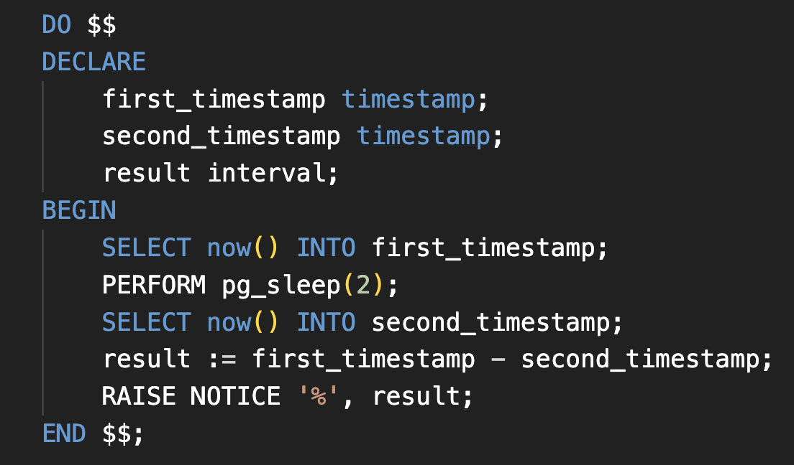

## What Will this PostgreSQL Code Print? 🤔

I couldn't believe this, at first!



Here's what I get from running the query:

```text
NOTICE: 00:00:00
DO
Total execution time: 00:00:02.072
```

**But why the result will be 00:00:00? 🤯**

This is because **now()** return the **start** time of the current transaction; not the clock time at which the function is called. So in our case both the `first_timestamp` and the `second_timestamp` will store exactly the same time, hence producing this zero interval!

Want to try it yourself? Check out the riddle [here on the Github](https://github.com/astorDev/persic/tree/main/postgres/now-riddle/riddle.sql).
